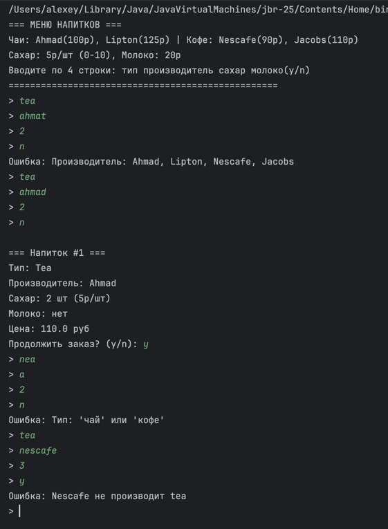
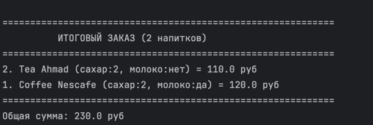

# Отчет по лабораторной работе №3
## Блошкин Алексей  
## 23-ПО-2

## **Цель работы**
Реализовать консольное приложение для заказа напитков (чай/кофе) в **чисто функциональном стиле**:
- **ADT** (алгебраические типы данных)
- **LazyList** (ленивые вычисления)
- **Без наследования**
- **Обработка "грязного" ввода**
- **Иммутабельность данных**

## Вариант
1.Вариант 1
Посетитель может заказать себе напитки: чай (черный или зеленый), кофе  
(черный или с молоком) разных производителей. Дополнительно в чай или  
кофе может быть положен сахар. Каждый компонент обладает своей  
стоимостью. Реализовать классовую модель и приложение, позволяющее  
формировать меню и пересчитывать его стоимость.  

## **Архитектура (3 файла)**

├── Drink.scala (ADT)  
├── Parser.scala (LazyList)  
└── Main.scala (рекурсивная логика)

## **Ключевые концепции**

### **1. ADT (Algebraic Data Types)**
sealed trait DrinkType // Sum-тип: "или"  
case object Coffee extends DrinkType  
case object Tea extends DrinkType  

sealed trait Producer // Sum-тип: конкретные бренды   
case object Ahmad extends Producer

case class Drink(...) // Product-тип: "и" (поля)  

### **2. LazyList — ленивый поток ввода**
def consoleInput: LazyList[String] = {  
def loop: LazyList[String] = {  
print("> ")  
StdIn.readLine() #:: loop // Лениво! Вычисляется по запросу  
}  
loop  
}  

### **3. Функциональный парсер**

def readDrink(ll: LazyList[String]): Either[ParseError, (Drink, LazyList[String])] = {  
ll match { // Pattern matching + деконструкция  
case typeStr #:: prodStr #:: sugarStr #:: milkStr #:: tail =>  
// Парсит 4 строки → Drink + остаток потока  
}  

## **Поток данных**
consoleInput()  
↓   
LazyList[String] (∞ поток строк)  
process(stream)  
↓   
Parser.readDrink(stream)  
Either[(Drink, LazyList[String])]  
↓   
ProductCatalog.price(drink) → Float  
OrderHistory(drinks: List[Drink]) ← :: (иммутабельно!)  
## Пример работы

итоговый вывод(не только то, что выше)  

